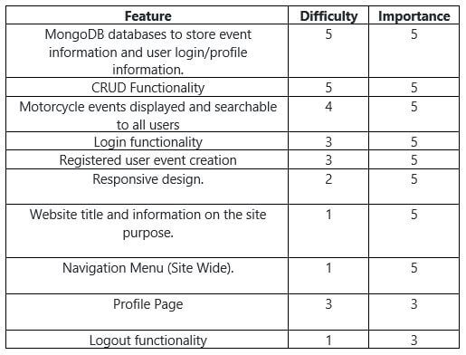
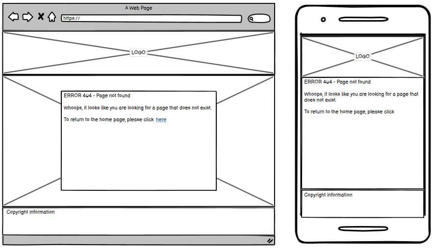
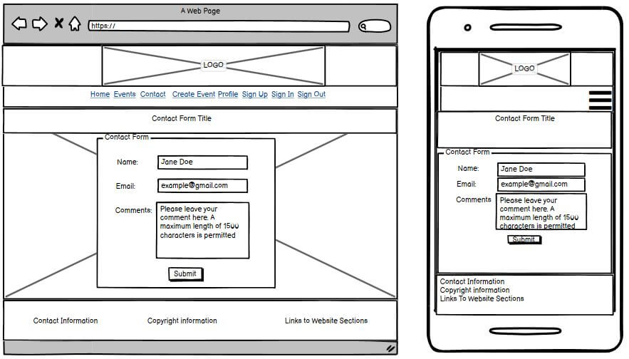
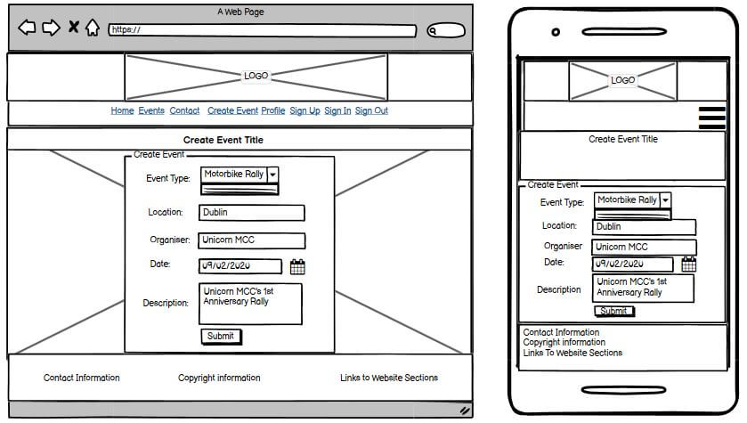
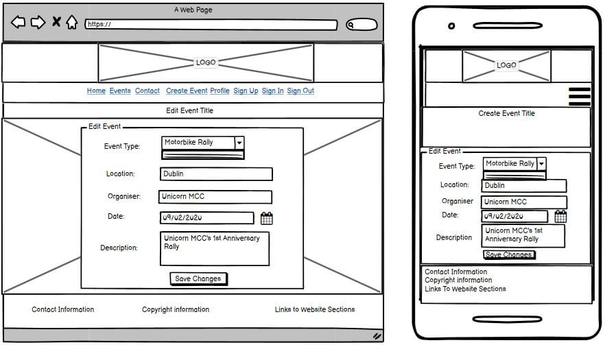
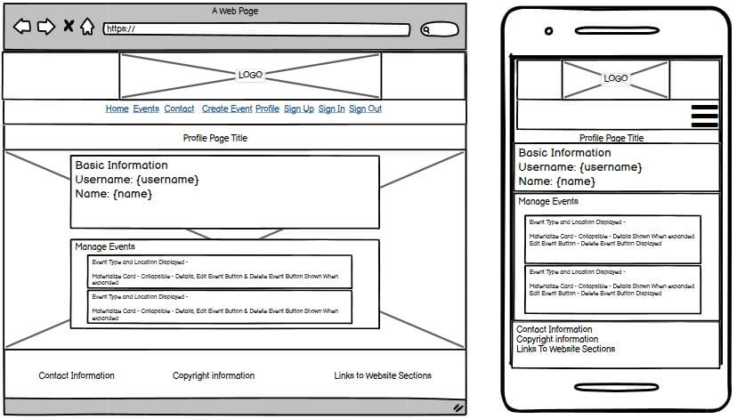

# Motorbike Event Finder

The Motorbike Event Finder does exactly what it says on the tin. It's a place where users can create and view 
Motorbike Events. The live Website can be found [here](https://motorbike-event-finder.herokuapp.com/).

## Table of Contents
* [User Experience Design (UX)](#User-Experience-Design)
    * [The Strategy Plane](#The-Strategy-Plane)
        * [Site Goals](#Site-Goals)
        * [User stories](#User-Stories)
    * [The Scope Plane](#The-Scope-Plane)
    * [The Structure Plane](#The-Structure-Plane)
    * [The Skeleton Plane](#The-Skeleton-Plane)
        * [Wireframes](#Wireframes)
        * [Database Design](#Database-Design)
    * [The Surface Plane](#The-Surface-Plane)
        * [Design](#Design)
            * [Colour Scheme](#Colour-Scheme)
            * [Typography](#Typography)
            * [Imagery](#Imagery)
    * [Differences to Design](#Differences-to-Design)
- [Features](#Features)
    * [Existing Features](#Existing-Features)
    * [Future Features](#Features-Left-to-Implement)
* [Technologies](#Technologies)
* [Testing](#Testing)
    * [Test Strategy](#Test-Strategy)
    * [Test Results](#Test-Results)
    * [Isses and Resolutions](#Issues-and-Resolutions-to-issues-found-during-testing)
* [Deployment](#Deployment)
    * [Project Creation](#Project-Creation)
    * [GitHub Pages](#Deployment-To-Heroku)
    * [Run Locally](#Run-Locally)
    * [Fork Project](#Fork-Project)
* [Credits](#Credits)
  * [Content](#Content)
  * [Acknowledgements](#Acknowledgements)

****

## User Experience Design
### **The Strategy Plane**

Although many events are advertised on social media, it can be difficult to keep track and keep record of them
as there is no single 'one page fits all'. As a biker himself, my client has requested this website for not only
his own personal use but for the local biking community to have easily accessible information in one place.

This website was created for client Gareth G as a 'One Stop Shop' for event loving bikers. The aim is to provide
users with a simple website that allows them to quickly find or create Motorbike Events that can be shared with
other motorcycle enthusiasts. All historical events should be recorded, although they do not have to  be displayed
 as this data will not be needed until phase two enhancements of the website.

#### Site Goals
* To increase the number of participants in Motorbike events by providing a simple, easy to use website that
contains all the details of upcoming events.
* Increase funds raised for charity by the Site owners personal motorcycle club through advertising their events
on the website.

#### User stories
* As a user, I want the main purpose of the site to be clear so that I immediately know what the site is 
intended for upon entering.
* As a user, I want to easily navigate the site so that I can find content quickly with ease.
* As a user, I want the website to be responsive so that I can clearly view the webpages from my mobile, 
tablet or desktop.
* As a user, I want to be able to register to the website so that I can create and manage my own events.
* As a user, I want to be able to search or filter events based on custom criteria so that I can find events
 suited to me.
* As a user, I want a way to contact the site owner so that I can have any questions I may have in 
regards to the website answered.
* As a user, I want to be able to return to the main site without having to use the browser buttons so 
that I can easily return to the website if I navigate to a page that doesn't exist.

### **The Scope Plane**

**Features planned:**
* Responsive design.
* Website title and information on the site purpose.
* Navigation Menu (Site Wide).
* MongoDB databases to store event information and user login/profile information.
* CRUD Functionality
* Login functionality.
* Logout functionality.
* Profile Page
* Motorcycle events displayed and searchable to all users.
* Registered user event creation and management.

### **The Structure Plane**
User Story:
> As a user, I want the main purpose of the site to be clear so that I immediately know what the site is 
intended for upon entering.

Acceptance Criteria:
* Site Logo to be displayed on the main navigation bar on all pages.
* Home Page to display Website Title and information to the user on the purpose of the site.

Implementation:

A site logo will be displayed on the main navigation menu. This should be 
displayed on all webpages.

The Website title will be displated as a h1 element on the home page and a detailed description of the 
site will be displayed on the Home page so that is evident of the websites
purpose as soon as the user visits the site.

User Story:
> As a user, I want to easily navigate the site so that I can find content quickly with ease.

Acceptance Criteria:
* Navigation menu to be displayed on all pages.
* All navigation links redirect to the correct pages.

Implementation:

A navigation menu will be displayed on all webpages. This will redirect users to the approriate page when 
clicked. On smaller devices, the menu will collapse into a hamburger menu to make efficient use to screen 
space. When clicked, the menu will expand out from the right side of the screen displaying all nav items.

The following navigation items will be implemented:

* Home - index.html
* Sign Up - register.html
* Sign In - login.html
* Profile - profile.html
* Events - events.html
* Create Event - create-event.html
* Contact - contact.html
* Sign Out - (redirects to home page)

User Story:
> As a user, I want the website to be responsive so that I can clearly view the webpages from my mobile, 
tablet or desktop.

Acceptance Criteria:
* Content should be responsive and display clearly on all devices with no horizontal scroll.

Implementation:

Materialize will be used for website layout with suitable column sizes and containers to ensure
that all content is displayed clearly on all devices with no horizonal scroll. Images will be responsive and 
scale to fit screen sizes with no stretch or distortion to ensure clear images are displayed to the user.

User Story:
> As a user, I want to be able to register to the website so that I can create and manage my own events.

Acceptance Criteria:
* Sign up - Login and Logout functionality to be added.
* User must have the ability to create, update and delete their own events.
* User must have a profile page displaying their basic details and events they have created.
* Only the creator of the events should have the ability to update or delete the events.

Implementation:

A Sign Up page will be implemented that allows users to register for an account on the website. The username
and password along with basic details for the users account will be stored in a MongoDB database collection 
called users. In order to create or modify events, a user will have to register and login to the website. 
Only the creator of the event will have the ability to update or delete the event, this is to prevent 
unwanted modification or deletion of events by other users. A flash message will be shown to the user to 
alert them whether the update or delete on their event was successful or failed.

A Sign In page will be implemented to allow registered users the ability to login in to their account. 

Once a user has successfully logged in, they will be redirected to their profile page. The users basic 
details will be displayed on their profile, along with any events they have created. The user will be able 
to update or delete their events from the profile page. This page will only be available to logged in users,
this includes the visibility of the navigation menu item.

A Sign Out button will be displayed to users who are logged in. When clicked this will sign the user out of the 
website and redirect them to the home page.

A Create Event page will be implemented that will be acessible and visible on the navigation menu to logged 
in users. The user will be able to create an event from this page. The event information will be stored in 
a MongoDB database collection called events and the event categories will be stored in a MongoDB collection 
called categories.

User Story:
> As a user, I want to be able to search or filter events based on custom criteria so that I can find events
 suited to me.

Acceptance Criteria:
* Events must be displayed to all users regardless of being logged in.
* Users should be able to search for events by Date, Location or Event Type.

Implementation:

An Events page will be implemented that is displayed to all users that is accessible to logged in or guests. 
This page will display the next six motorbike events from today's date on a materialize collapsible element. In order to 
make use of space, these events will be collapsable and can be expanded to view details on click.

A search box will be displayed on screen which will allow users to search for events based on Date, Event 
Type or Location. This will return a filtered, full list of future events for the current search criteria. 
This will be implemented by using a database index that will be created on the MongoDB collection events.

User Story:
> As a user, I want a way to contact the site owner so that I can have any questions I may have in 
regards to the website answered and receive feedback to alert on status of form submission.

Acceptance Criteria:
* Contact page should be added with a contact form. This form should only submit with valid data input.
* Contact form should not submit with invalid data input.
* User should be alerted of success/failure status of form submission.

Implementation:

A contact page will be added that contains a materialize form, this will allow users to contact the site 
owner. The EmailJS API will be used in order to implement this feature and a flash message will be 
displayed to alert the user if the contact form submitted successfully or unsuccessfully.

Validation will be performed on the form to ensure valid data input. The form will not submit if any 
field is blank.

Form Fields:
* Name - Type: Text, required.
* Email - Type: Email, required.
* Comments - Type: TextArea, required.

User Story:
> As a user, I want to be able to return to the main site without having to use the browser buttons so 
that I can easily return to the website if I navigate to a page that doesn't exist.

Acceptance Criteria:
* If a user redirects to the wrong page, an error will display that contains a link to go back to the main 
website.

Implementation:

A custom 404 page will be created so that if a user attempts to nagiate to a page that it not found, an 
error will be displayed. This page will contain a clickable anchor link to allow the user to redirect to 
the main website without needing to use the browser navigation buttons.

### **The Skeleton Plane**
#### Wireframes
[Home](readme_images/wireframes/home.pdf)

[404](readme_images/wireframes/404.pdf)

[Contact](readme_images/wireframes/contact.pdf)

[Create Event](readme_images/wireframes/create_event.pdf)

[Edit Event](readme_images/wireframes/edit_event.pdf)

[Events](readme_images/wireframes/events.pdf)

[Profile](readme_images/wireframes/profile.pdf)

[Sign In](readme_images/wireframes/signin.pdf)

[Sign Up](readme_images/wireframes/signup.pdf)

#### Database Design
MongoDB Object format examples:

**Collection: categories** 
{ 
&nbsp;&nbsp;&nbsp;&nbsp;_id: unique-value, 
&nbsp;&nbsp;&nbsp;&nbsp;event_type: "Rally" 
}

**Collection: events** 
{ 
&nbsp;&nbsp;&nbsp;&nbsp;_id: unique-value, 
&nbsp;&nbsp;&nbsp;&nbsp;event_type: "Rally", 
&nbsp;&nbsp;&nbsp;&nbsp;location : "Wexford", 
&nbsp;&nbsp;&nbsp;&nbsp;date : "09 February, 2021", 
&nbsp;&nbsp;&nbsp;&nbsp;description : "This Rally is hosted by Unicorn MCC.", 
&nbsp;&nbsp;&nbsp;&nbsp;organiser : "Daisy McGirr" 
&nbsp;&nbsp;&nbsp;&nbsp;created_by : session[user] 
}

**Collection: users** 
{ 
&nbsp;&nbsp;&nbsp;&nbsp;_id: unique-value, 
&nbsp;&nbsp;&nbsp;&nbsp;username: "Admin", 
&nbsp;&nbsp;&nbsp;&nbsp;password : "12a6yt&jddn", 
&nbsp;&nbsp;&nbsp;&nbsp;name : "Jane Doe", 
}

### **The Surface Plane**
### Design

#### Colour Scheme
The main background colour is a cream  for the header, footer
and all button backgrounds. 

The main website text is black 

All custom heading text is a deep shade of red 

#### Typography
The main heading on all pages and in the expanded materialize collapsible element headings use the 'PT Serif' font while the 
rest of the websites content uses the 'Play' font.

#### Imagery
A background image will be used on all pages displaying a map of Ireland, this image was 
taken from [mapswire](https://mapswire.com/countries/ireland/). 

The website logo was created using online software from the website [Canva](https://www.canva.com/).

The home page image of the bride and motorbike burnouts is property of Debbie Harkin. - Permission was granted 
to use the image.

The second home page image of the three biker meet is property of Connor Meehan. - Permission to use this was given.

#### Differences to Design
After meeting with the client, Gareth G half way through the project, some of the Design was changed as it did not 
meet expectations. The colour scheme for the Website and fonts were changed as per the clients request.

In the original wireframes the Logo was centered and nav items split to the left and right side. This design did 
not look well on the page, it left too much white space, nav items were too spaced on extra large screens and upon 
reading about UX Design standards or navigations, it did not really confirm to norms or user friendly design. The design 
was then changed to have a banner with a large logo across the top of the page, with the navigation items sat underneath.

Original design and wireframes had the text input used to search events as a dual box that could search by either 
location or date. This proved difficult to implement and was agreed upon with the client to add an additional date 
picker search field. 
Search fields were also changed to be single column fields. The reasoning for this was 
[article](https://cxl.com/blog/form-design-best-practices/) on form best practices.

Additional verification was addd to the event deletion button to take user confirmation they want to delete the event. 
This was added so the user doesn't accidentally delete an event and was implemented using a modal with the option to 
cancel or delete.

500 Error page was not included in the original design but was implemented with the same page layout as the 404 page 
to account for any internal server errors.
****
## Features

### Existing Features

* Home page displaying images and information on the sites purpose.
* User sign up functionality.
* Sign in / Sign out functionality.
* Event page that displays the next six events from todays date and allows users to search for events.
* Create event page allowing signed in users to create events.
* Profile page showing basic user information and events created by the user with modification ability.
* Contact page with form and EmailJS functionality to contact site owner.
* Mobile responsive design.
* Site wide footer containing contact information, Copyright info and Site Links.

### Features Left to Implement

A feature to be included in the next release will allow users the ability to upload their own custom event posters. 
These will be displayed in the materialize collapsible elements along with the event information.

Admin login will be implemented in the next release to allow admin users to delete any events that may be inappropriate.
****
## Technologies
* [HTML](https://en.wikipedia.org/wiki/HTML)
	* This project uses HTML as the main language used to complete the structure of the Website.
* [CSS](https://en.wikipedia.org/wiki/CSS)
	* This project uses custom written CSS to style the Website.
* [JavaScript](https://en.wikipedia.org/wiki/JavaScript)
    * JavaScript is used along with [emailjs](https://www.emailjs.com/) for the contact form. This sends an email to the owner
    on form submit.
    * [jQuery](https://jquery.com/) is used for the following: 
        * Mobile side nav
        * Displaying Success/Fail message verifying contact form status.
        * Collapsible Materialize elements.
        * Materialize modal.
        * Datepicker functionality on forms.
        * To populate downdrops on select elements.
* [Python](https://www.python.org/)
    * This projects core was created using Python, the back-end logic and the means to run/view the Website.
    * Python Modules used (These can be found in the requirements.txt project file):
        * dnspython==2.0.0
        * Flask==1.1.2
        * Flask-PyMongo==2.3.0
        * Flask-WTF==0.14.3
        * itsdangerous==1.1.0
        * pymongo==3.11.2
        * Werkzeug==1.0.1
        * WTForms==2.3.3
* [MongoDB](https://www.mongodb.com/1)
    * MongoDB was used to create the document based databases(collections) used as data storage for this project.
* [Materialize](https://materializecss.com/)
    * The Materialize framework was used through the website for layout and responsiveness.
* [Google Fonts](https://fonts.google.com/)
	* Google fonts are used throughout the project to import the *Inter* and *Bevan* fonts.
* [GitHub](https://github.com/)
	* GithHub is the hosting site used to store the source code for the Website.
* [Git](https://git-scm.com/)
	* Git is used as version control software to commit and push code to the GitHub repository where the source code is stored.
* [Heroku](https://dashboard.heroku.com/apps)
    * Heroku was used to deploy the live website.
* [TinyJPG](https://tinyjpg.com/)
	* TinyJPG/TinyPNG is used to reduce the file sizes of images before being deployed to reduce storage and bandwith.
* [Google Chrome Developer Tools](https://developers.google.com/web/tools/chrome-devtools)
	* Google chromes built in developer tools are used to inspect page elements and help debug issues with the site layout and test different CSS styles.
* [balsamiq Wireframes](https://balsamiq.com/wireframes/)
	* This was used to create wireframes for 'The Skeleton Plane' stage of UX design.
* [Canva](https://www.canva.com/)
    * Canva design was used in order to create the website logo.
* [Font Awesome](https://fontawesome.com/)
    * All the Icons displayed throughout the website are Font Awesome icons.
* [Favicon](https://favicon.io/)
    * Favicon.io was used to make the site favicon 
* [Techsini](http://techsini.com/multi-mockup/index.php)
    * Multi Device Website Mockup Generator was used to create the Mock up image in this README

****
## Testing

### Test Strategy
#### **Summary**
Testing is required on all features and user stories documented in this README. 
All clickable links must redirect to the correct pages. All forms linked to MongoDB
must be tested to ensure they insert all given fields into the correct collections.

HTML Code must pass through the [W3C HTML Validator](https://validator.w3.org/#validate_by_uri).

CSS Code must pass through the [W3C CSS Validator](https://jigsaw.w3.org/css-validator/).

JavaScript code must pass through the [JSHint Validator](https://jshint.com/).

Python Code must pass through [PEP8 Validator](http://pep8online.com/)
#### **High Level Test Cases**

#### **Access Requirements**
Tester must have access to MongoDB in order to manually verify the insertion 
of records to users and events collections.

#### **Regression Testing**
All features previous tested during development in a local environment must be regression 
tested in production on the live website.

#### **Assumptions and Dependencies**
Testing is dependent on the website being deployed live on Heroku.

#### **Out of Scope**
Only test cases listed under High Level Test Cases will be performed as part of this 
testing effort.

### Test Results

Full test results can be found [here](TESTING.md)

****
## Deployment

### Project Creation
To create this project I used the CI Gitpod Full Template by navigating 
[here](https://github.com/Code-Institute-Org/gitpod-full-template) and clicking the 'Use this template' button.

I was then directed to the create new repository from template page and entered in my desired repo name, then 
clicked Create repository from template button.

Once created, I navigated to my new repository on GitHub and clicked the Gitpod button which built my workspace.

The following commands were used for version control throughout the project:

* git add *filename* - This command was used to add files to the staging area before committing.

* git commit -m "commit message explaining the updates" - This command was used to to commit changes to the local repository.

* git push - This command is used to push all committed changes to the GitHub repository.

### Deployment to Heroku

**Create application:**
1. Navigate to Heroku.com and login.
1. Click on the new button.
1. Select create new app.
1. Enter the app name.
1. Select region.

**Set up connection to Github Repository:**

1. Click the deploy tab and select GitHub - Connect to GitHub.
1. A prompt to find a github repository to connect to will then be displayed.
1. Enter the repository name for the project and click search.
1. Once the repo has been found, click the connect button.

**Set environment variables:**

Click the settings tab and then click the Reveal Confid Vars button and add the following:

1. key: IP, value: 0.0.0.0
2. key: PORT, value: 5000
3. key: MONGO_DBNAME, value: (database name you want to connect to)
4. key: MONGO_URI, value: (mongo uri - This can be found in MongoDB by going to clusters > connect > connect to your application and substituting the password and 
    dbname that you set up in the link).
5. key: SECRET_KEY, value: (This is a custom secret key set up for configuration to keep client-side sessions secure).

**Enable automatic deployment:**
1. Click the Deploy tab
1. In the Automatic deploys section, choose the branch you want to deploy from then click Enable Automation Deploys.

### Run Locally

**Note: The project will not run locally with database connections unless the user sets up an [env.py](https://pypi.org/project/env.py/) file configuring IP, PORT, 
MONGO_URI, MONGO_DBNAME and SECRET_KEY. You must have the connection details in order to do this. These details are private and not disclosed in this repository 
for security purposes.**

1. Navigate to the GitHub [Repository](https://github.com/Daisy-McG/Motorbike-Event-Finder).
1. Click the Code drop down menu.
1. Either Download the ZIP file, unpackage locally and open with IDE (This route ends here) OR Copy Git URL from the HTTPS dialogue box.
1. Open your developement editor of choice and open a terminal window in a directory of your choice.
1. Use the 'git clone' command in terminal followed by the copied git URL.
1. A clone of the project will be created locally on your machine.

### Fork Project 

Most commonly, forks are used to either propose changes to someone else's project or to use someone else's project as a starting point 
for your own idea. - Definition from [Github Docs](https://docs.github.com/en/free-pro-team@latest/github/getting-started-with-github/fork-a-repo).

1. Navigate to the GitHub Repository you want to fork.
1. On the top right of the page under the header, click the fork button.
    
    
1. This will create a duplicate of the full project in your GitHub Repository.

****
## Credits

Background image - Taken from [mapswire](https://mapswire.com/countries/ireland/). 

Website Logo - Created with [Canva](https://www.canva.com/).

### Code

[Stack Overflow](https://stackoverflow.com/questions/35843675/link-to-a-specific-location-in-a-flask-template) - The code used to navigate 
to a specific section of a page using Flask templates was taken from here.

[Stack overflow](https://stackoverflow.com/questions/5272433/html5-form-required-attribute-set-custom-validation-message) - The code used to 
create custom error messages on invalid form inputs was copied and modified from this stack overflow post.

[Stack overflow](https://stackoverflow.com/questions/38964113/how-can-i-create-a-navbar-with-center-aligned-links-using-materialize) - The CSS 
used to center the nav bar was gotten from this stack overflow post. 

[W3Schools](https://www.w3schools.com/tags/tag_figcaption.asp) - The figure and caption code on the home page images was done by following 
a W3Schools tutorial.

### Acknowledgements

I'd like to give special thanks to the the following people for their help with my project:
* Slack user Seán for providing me information on how to implement 404 and 500 page routing with flask and helping me debug why 
the Manage Events title was showing when the user had no events. Also for the help with my delete unit test.
* Slack user Anthony for his help with my error/message Flash messages.
* Slack user Bim for his help with good UX Design practices and showing articles referencing these.
* My mentor Spencer Baribell for his guidance throughout the project.

****
